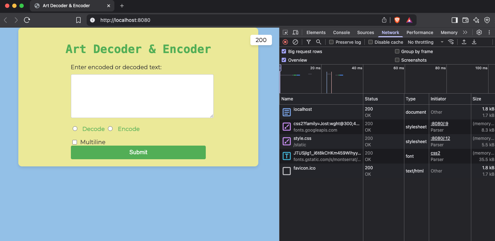

# Art Decoder
## Project Structure
art/
├── input/              # Input .txt files
├── utils/              # Encoding/decoding logic
├── web/
│   ├── static/
│   │   ├── style.css   # Styles including dark/light theme
│   │   └── index.html  # Web UI template
├── main.go             # CLI and web server logic
├── go.mod
└── README.md

This is a command-line tool to help you convert text-based art into a readable format and vice versa.
It can **decode** and **encode** text-based images in a simple and easy way.

---

## ✨ Features

- **Decode single-line art**: Converts patterns like `[5 #]` into repeated characters.
- **Encode text-based art**: Converts plain art into encoded format such as `[5 #]`.
- **Multi-line encoding**: Encodes multi-line text artIf i put 
- **Error handling**: Displays user-friendly error messages for invalid inputs.

---

## 🖥️ Terminal Commands

## Server Mode (Web UI)
```bash 
go run . -s
```
##

### ➤ Decode a single-line string
```bash "[5 #][5 -_]-[5 #]"  ```


**Output:**

```bash
#####-_-_-_-_-_-#####
```

---

**Output:**

```bash
[5 #][5 -_]-[5 #]
```


## 🧪 Multiline Decode Example


```
[8  ]@|\[2 @]
[7  ]-[2  ][4 @]
[6  ]/7[3  ][4 @]
[5  ]/[4  ][6 @]
[5  ]\-' [8 @]`-[15 _]
[6  ]-[9 @][13  ]/[4  ]\
 [7 _]/[4  ]/_[7  ][6 _]/[6  ]|[10 _]-
/,[10 _]/  `-.[3 _]/,[13 _][10 -]_)
```

Output:

```
        @|\@@
       -  @@@@
      /7   @@@@
     /    @@@@@@
     \-' @@@@@@@@`-_______________
      -@@@@@@@@@             /    \
 _______/    /_       ______/      |__________-
/,__________/  `-.___/,_____________----------_)
```
## screenshots

### home page 
200 status



### decode page


### mulitline error with 400 statsus


---
## ✅ Enjoy using Art Decoder Interface!